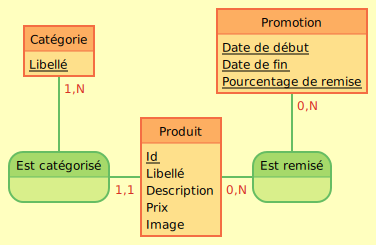

 

# mercadonaStudi
Dépôt pour le projet Mercadona sur Studi

## Documentation

Vous pouvez aussi voir la documentation de l'API sur [SwaggerUI](https://mercadona-studi.ddns.net/swagger)

## Modèle Conceptuel des Données

[Mocodo](https://www.mocodo.net/) :

 
Catégorie: Libellé 
: 
Promotion: Date de début, _Date de fin, _Pourcentage de remise 
 
Est catégorisé, 11 Produit, 1N Catégorie 
Produit: Id, Libellé, Description, Prix, Image 
Est remisé, 0N Produit, 0N Promotion 
 

 

## Compte utilisateur de test

Vous pouvez tester l'application avec le compte ayant pour mail : toto@toto.fr
et commme mot de passe : L@T3t3@T0t0
